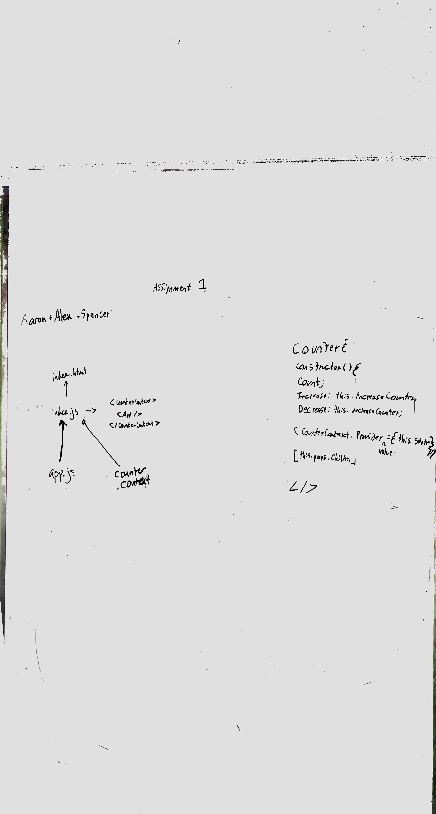
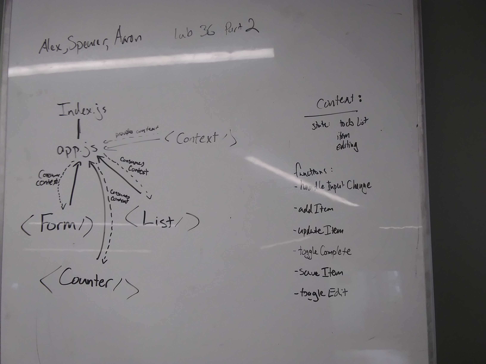

# Lab36 Aaron Ferris, Alexander White, Spencer Hirata

============================================================================  
Date: May 6th, 2019

[LAB INSTRUCTIONS](./LAB.md)

### Assignment 1 - Counter

- [Code Sandbox Link](https://codesandbox.io/s/mqwzmm62y8)
- [Pull request]()

[x] Create a Counter Provider component, which exposes the following state:

- [x] `count` - A number (default to 0)
- [x]`increment` - A reference to a function that increases the count
- [x] `decrement` - A reference to a function that decreases the count
- [x] In the index.js, import CounterContext and wrap `<App />` in it, so that all child components can optionally subscribe to it as consumers.
- [x] Your `<App />` component should simply pull in and render the following child components ...
- Create the following child components that register as a `.Consumer` to the provided context.
  - [x] `<Incrementer />` - Renders a button that, when clicked, calls the `increment()` method in the `Counter Provider`
  - [x] `<Decrementer />` - Renders a button that, when clicked, calls the `decrement()` method in the `Counter Provider`
  - [x] `<Counter />` - Renders the current value of `count` from the Counter Provider
- [ ] Provide good styling. Use the css-in-js methodology within the components themselves.

## Assignment 2 - To Do

- [Code Sandbox Link](https://codesandbox.io/s/q75jyx4jjq)

- [Pull request]()

You have been provided, in the `starter-code` folder, a working To Do manager application, written using standard React Component State

- [x] Refactor the app to make use of Context
- [x] Create a `context` for the Application
- [x] Create a separate `<Counter />` component that reads and displays the `count` from Context
- Create separate components for the main To App elements
  - [x] `form` - Adds and updates to do list items
  - [x] `list` - Lists items, manages complete state and form visibility

### Testing

[ ] Do a deep mount of the app, and set tests to make assertions on the child components that consume context from the Provider.

[ ] Can they see context?
[ ] Can they interact via published functions?

## Approach and drawing

